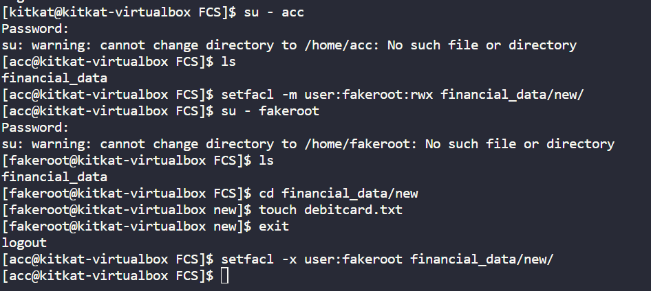
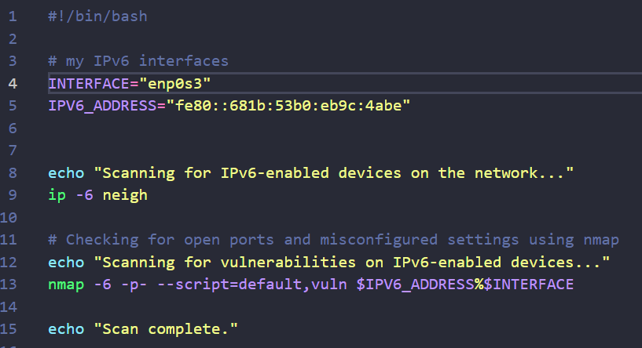

# CSE 345/545: Foundations of Computer Security
> Assignment: 1

## Cryptography
you can find my AES code in the file [q1_ Ankit _ Kumar_ 2021015.py](/q1_Ankit_Kumar_2021015.py) which does what it supposed to do. 

## 2. Access Control Mechanism
1. I have created a new user called *acc* and a new group called *accounting*. *accounting* group contains *acc* user.
 

2. Granting read and write access to the 'accounting' group for 'financial_data' and its contents

3. Demonstrating read/write access for a user *acc* within the *accounting* group and the automatic inheritance of ACL settings for new files and directories

4. Demonstrating restricted access for a test user outside the *accounting* group. As you can see *fakeroot* user can't create(write access) any new file in the *financial_data* directory

grant temporary write access to a specific subdirectory within *financial_data* for a user(*fakeroot*) from a new group

## 3. Authentication

### Find code in question3_jwt.py

The output 

JWTs are widely used for various authentication and authorization scenarios due to their flexibility and ease of implementation
    - JWTs are commonly used for user authentication in web applications.
    - JWTs are used for SSO to allow users to access multiple applications with a single login.
    - JWTs are often used for securing API endpoints.

Some improvements:
- Implement mechanisms for securely storing tokens on client devices, such as using secure storage and encrypted tokens. Offer token revocation mechanisms to allow users to log out and invalidate tokens.

- Implement short-lived tokens for these use cases and provide a secure mechanism for token generation and validation. Ensure tokens are invalidated after use or upon account recovery.

source: https://www.linkedin.com/advice/3/what-pros-cons-using-tokens-jwts-authentication

## 4. Networking Protocols and Security

### IPv6

1.  
    - IPv6 (Internet Protocol version 6) is a network layer protocol designed to replace IPv4 (Internet Protocol version 4).
    - It was developed to address the limitations of IPv4, mainly due to the exhaustion of IPv4 addresses.

    Key Differences Between IPv6 and IPv4:
    - IPv6 uses a 128-bit address format, providing a vastly larger address space compared to IPv4's 32-bit address space.
    - IPv6 supports auto-configuration, simplifying network setup.
    - IPv6 incorporates better support for multicast communication.
    - IPv6 includes built-in security features, such as IPsec, as a mandatory part of the protocol.

2. 
    Security benefits of IPv6:
    - _**Enhanced Address Security:**_ IPv6's larger address space makes it harder for attackers to guess or scan/spoof IP addresses, improving host privacy.

    - **_Built-in IPSec:_** IPv6 mandates IPsec, offering end-to-end encryption, authentication, and integrity protection.

    - **_Improved Neighbor Discovery:_** IPv6 has a more secure Neighbor Discovery Protocol, reducing risks associated with ARP poisoning.

    Security Challenges:
    - _**Transition Period:**_ Coexistence with IPv4 during the transition phase can introduce security complexities.

    - _**Lack of Compatibility:**_ Some legacy systems and network devices may not fully support IPv6, leading to dual-stack environments that require careful management.

    - **_Misconfiguration:_** IPv6 introduces new configuration elements that can be misconfigured, potentially leading to security vulnerabilities.

3. My script is as follows
    

    - As you can see from the ss, my interface name is enp0s3 which is a bridged connection from host to vm.

    - After running the script i get the following output
    

    IPv6-enabled devices on the network:

    - fe80::ba08:2001:2ee0:60fa with MAC address 04:c8:07:2b:41:16 is reachable and is a router.
    - fe80::5c6a:7aff:fe0d:4709 with MAC address 5e:6a:7a:0d:47:09 is in a stale state.
    - fe80::1 with MAC address 50:5d:ac:94:52:71 is also in a stale state and is a router.

    Vulnerabilities on IPv6-enabled devices:
    The scan was performed on the IPv6 address fe80::681b:53b0:eb9c:4abe.
    - The host is up and has a very low latency.
    - Out of 65535 TCP ports, 65534 are closed (connection refused), which is a good sign as it means those ports are not exposed.
    - port 22/tcp is open, which is the default port for SSH. This means that SSH is running on this device(currently using it with vscode to write this very report). If SSH is not configured securely, it can be a potential vulnerability. For instance, if weak passwords are used or if root login is allowed without a key, it can be exploited.

    Tools used:
    - ip: A cli utility to show or manipulate routing, devices, policy routing, and tunnels.
    - nmap: A free and open-source network scanner used to discover devices running on a network and find open ports along with various attributes of the network.

