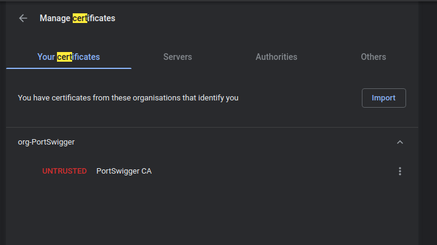
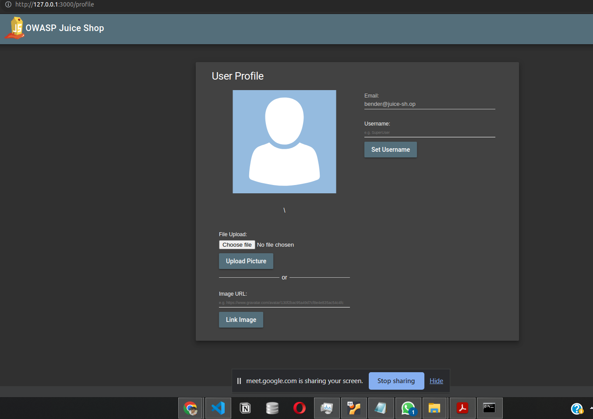

# Foundation of Computer Security
## Assignment 2

### 1. Phishing 
[This is only for academic purposes and I do not promote any thing related to hacking🧢]
- Made a phishing website using HTML, CSS and Django, mimicking the original website of the Google Signing Page.
- The website is hosted on a local server using Django.


- It takes the username and password from the user and stores it in a text file. and show a new page saying "you have been hacked".


- The credentials will be saved for the users who are foolish enough to enter their credentials.


There are Various ways to prevent phishing attacks:
- **Use of SSL certificates** - Ensure the websites you visit use HTTPS, especially for sensitive transactions.
- **Double check the URL** - Hover over links to see the actual URL before clicking. Make sure it matches the legitimate website.
- **Beware of Urgent Requests** - Phishers often create a sense of urgency; be cautious when asked for immediate action
- **Regularly Monitor Accounts** - Keep an eye on our online accounts for any unauthorized activity and turn on 2FA and notifications for logins.
- 

### 2. Burpsuite








### 3. BlockChain
- used ipfs to crease image and json links

- NFT Details are as follows
```
{
"metamask_public_address": "0x876d0770426B0F5388a8E961D407e9ffd1Fc2584",
"contract_address": "0xaB590a100264DCE5a25d2a6b869A24bC5875b568",
"nft_transaction_hash": "0x045852f21acebde01496f447d8e0a7239987fca5202e79aa385ae5dbc00c2664",
"image_ipfs_cid": "QmRqt6VNdo1ZotmFU4fg77YskmbnXywXTym8bbYzfd6MPg",
"metadata_ipfs_cid": "QmeVG6Y2iL1z29Jsi9fSwUKHGgdStxw1EmkchYbK59uvhk"
}
```

- Used https://sepolia.etherscan.io/ to create test ether.
- Following functions they deployed over the blockchain

- Blockchain Transaction Screenshot


### 4. Nhi kara