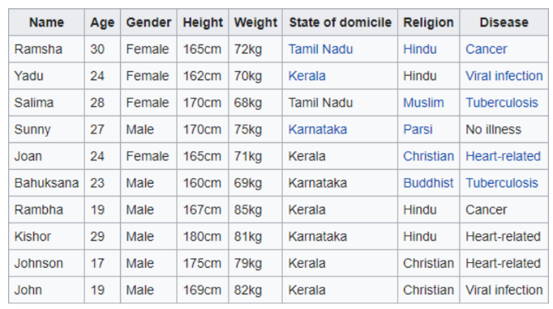
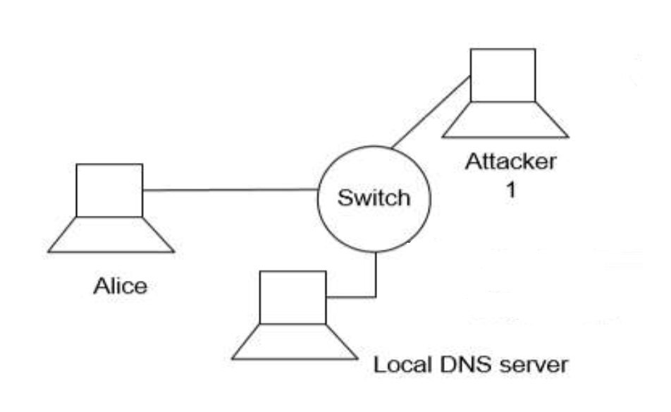
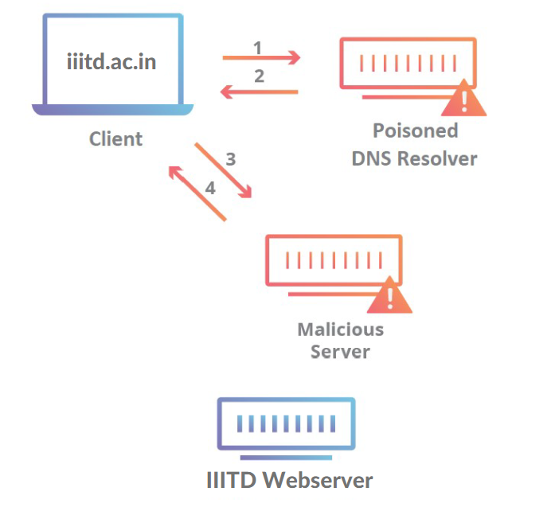
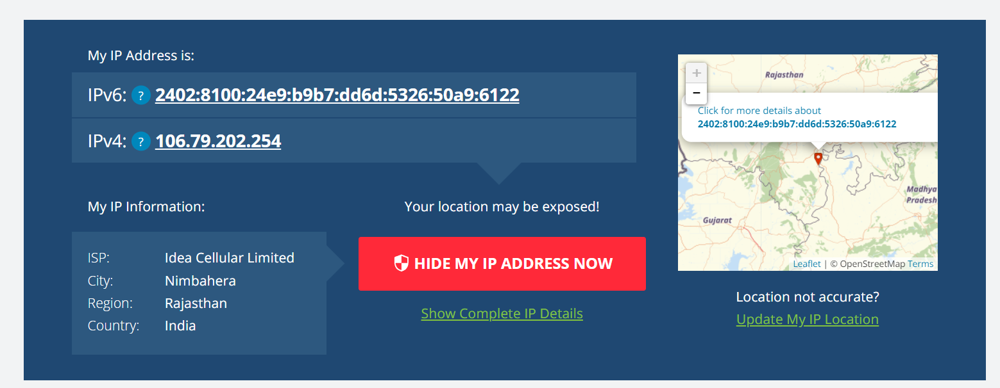
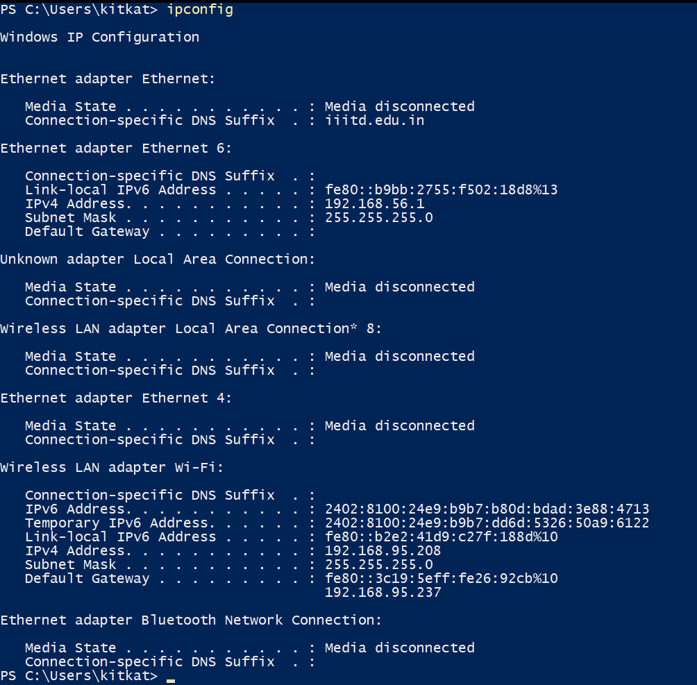

# CSE 345/545 Foundations to Computer Security'

## Mid-Sem Exam Report

 - Ankit Kumar(2021015) 

### 1. Privacy
a. Apply K-Anonymity with value of K as 2 and 3. Submit the anonymized tables.

- k=2 Anonymity:

| Age    | Gender  | Height   | Weight  | State of Domicile  | Religion   | Disease          |   |   |   |
|--------|---------|----------|---------|--------------------|------------|------------------|---|---|---|
| 20−30  | Female  | 160−170  | 70−80   | Tamil Nadu         | Hindu      | Cancer           |   |   |   |
| 20−30  | Female  | 160−170  | 60−70   | Kerala             | Hindu      | Viral Infection  |   |   |   |
| 20−30  | Female  | 160−170  | 60−70   | Tamil Nadu         | Other      | Tuberculosis     |   |   |   |
| 20−30  | Male    | 160−170  | 70−80   | Karnataka          | Other      | No Illness       |   |   |   |
| 20−30  | Female  | 160−170  | 70−80   | Kerala             | Christian  | Heart Related    |   |   |   |
| 20−30  | Male    | −        | 60−70   | Karnataka          | Other      | Tuberculosis     |   |   |   |
| 0−20   | Male    | 160−170  | 80−90   | Kerala             | Hindu      | Cancer           |   |   |   |
| 20−30  | Male    | 170−180  | 80−90   | Karnataka          | Hindu      | Heart Related    |   |   |   |
| 0−20   | Male    | 170−180  | 70−80   | Kerala             | Christian  | Heart Related    |   |   |   |
  
  
     

- k=3 Anonymity:

| Age    | Gender  | Height   | Weight  | State of Domicile  | Religion   | Disease          |   |   |   |
|--------|---------|----------|---------|--------------------|------------|------------------|---|---|---|
| 20−30  | Female  | 160−170  | 70−80   | Other              | Hindu      | Cancer           |   |   |   |
| 20−30  | Female  | 160−170  | 60−70   | Kerala             | Hindu      | Viral Infection  |   |   |   |
| 20−30  | Female  | 160−170  | 60−70   | Other              | Other      | Tuberculosis     |   |   |   |
| 20−30  | Male    | 160−170  | 70−80   | Karnataka          | Other      | No Illness       |   |   |   |
| 20−30  | Female  | 160−170  | 70−80   | Kerala             | Christian  | Heart Related    |   |   |   |
| 20−30  | Male    | −        | 60−70   | Karnataka          | Other      | Tuberculosis     |   |   |   |
| 0−20   | Male    | 160−170  | 80−90   | Kerala             | Hindu      | Cancer           |   |   |   |
| 20−30  | Male    | 170−180  | 80−90   | Karnataka          | Hindu      | Heart Related    |   |   |   |
| 0−20   | Male    | 170−180  | 70−80   | Kerala             | Christian  | Heart Related    |   |   |   |

Explaining the above tables:
In the 2-anonymized table, each combination of quasi-identifiers is indistinguishable from at least one other row, while in the 3-anonymized table, each combination of quasi-identifiers is indistinguishable from at least two other rows. This means that the 3-anonymized table is more generalized and potentially loses more information compared to the 2-anonymized table. For example, in the 3-anonymized table, the *State of Domicile* for *Ramsha* and *Salima* has been generalized to *Other*, while it remains specific in the 2-anonymized table.

b.

- *Hierarchical Generalization:* Instead of generalizing the data uniformly for all entries, we can create a hierarchy of generalization levels and apply them differently based on the distribution of the data. This way, less common values can be generalized more, and common values can retain more information.
For the "State of Domicile", instead of generalizing all states with fewer occurrences to "Other", we can create a hierarchy like: `State -> Region -> Country`. *Tamil Nadu* and *Karnataka* can be generalized to *South India* instead of *Other*. Although the difference is not significant in this case, it can be useful for other attributes with a large number of values.

- *Adding Noise:* We can add noise to continuous quasi-identifiers like Age, Height, and Weight. This can be done by adding or subtracting a small random value to these attributes. We must ensure that the noise is small enough to maintain data utility but large enough to protect privacy. 
For example, we can add a random value between -10 and 10 to the Age of each person. This will make it harder to identify a specific person based on their age but it will decrease the actual statistical accuracy of the data.

c. The checklist that is available on the GDPR website https://gdpr.eu/checklist/ for this particular case is as follows:

+ Provide clear information about your data processing and legal justification in your privacy policy.
+ Encrypt, pseudonymize, or anonymize personal data wherever possible.
+ Have a process in place to notify the authorities and your data subjects in the event of a data breach.
+ It's easy for your customers to request to have their personal data deleted.
+ It's easy for your customers to receive a copy of their personal data in a format that can be easily transferred to another company.

Now considering the above checklist, the following are the steps that I will take to ensure that the data is GDPR compliant and the task is completed.

1. I'll create a dummy data with fields Name, Roll number, email, Program, branch and survery response. I'll also create a privacy policy which will be available on the website and will be accessible to everyone. 

2. Now I'll apply Anonymization, Pseudonymization and Differential Privacy.

Orignal Data:

| Name            | Roll Number  | Email                 | Program  | Branch  | Experience Rating  |
|-----------------|--------------|-----------------------|----------|--------|--------------------|
| Ankit Kumar     | 2021015      | studentA@iiitd.ac.in  | M.Tech   | CSE    | 4                  |
| Chaitanya Arora | 2021033      | studentB@iiitd.ac.in  | B.Tech   | CSAM   | 5                  |
| Lakshay Chauhan | 2021060      | studentC@iiitd.ac.in  | B.Tech   | CSE    | 3                  |
| Najiya Naj      | MT22004      | studentD@iiitd.ac.in  | M.Tech   | CSE    | 4                  |
| Sameer Gupta    | 2021093      | studentE@iiitd.ac.in  | B.Tech   | EVE    | 5                  |
| Saloni Garg     | MT22005      | studentF@iiitd.ac.in  | M.Tech   | CSE    | 3                  |

- For anonymization, I'll remove the name, roll number and email from the data and will only keep the program, branch and experience rating. 

- For pseudonymization, direct identifiers have been replaced with pseudonyms represented by a "Student ID", which are unique codes assigned to each student.

| Student ID | Program  | Major  | Experience Rating  |
|------------|----------|--------|--------------------|
| 1          | M.Tech   | CSE    | 4                  |
| 2          | B.Tech   | CSAM   | 5                  |
| 3          | B.Tech   | CSE    | 3                  |
| 4          | M.Tech   | CSE    | 4                  |
| 5          | B.Tech   | EVE    | 5                  |
| 6          | M.Tech   | CSE    | 3                  |

- For differential privacy, I'll add the range to the experience.

| Student ID | Program  | Major  | Experience Rating  |
|------------|----------|--------|--------------------|
| 1          | M.Tech   | CSE    | 3-5                |
| 2          | B.Tech   | CSAM   | 5                  |
| 3          | B.Tech   | CSE    | 3-5                |
| 4          | M.Tech   | CSE    | 4                  |
| 5          | B.Tech   | EVE    | 3-5                |
| 6          | M.Tech   | CSE    | 3-5                |

---
### 2. Network Security

a. How attacker 1 to perform DNS poisoning attack?

As you can see from the above image, The attacker is directly connected to the LDS and Alice via switch so there are two ways attacker can perform DNS poisoning attack.

1. DNS cache poisoning[client level]: If attacker could get the access of Alice's machine, Then they can modify the cached dns stored in alice's machine(the cached dns is a feature of DNS TTL). 
Since in most linux environment, the dns settings are located in `/etc/resolv.conf`, attacker can also point Alice machine to a malicious dns server owned by attacker.

2. DNS cache poisoning[server level]: In this method, attacker 1 will try to overwhelm the Local DNS server with a large number of requests.

* Steps:
    1. attacker will make a fake HTML web-page of the webserver which alice wanted to connect to(phishing web-page). 
    2. Now attacker could use any available tool on linux to do it lets say they uses Ettercap. 
    3. The attacker then set up attack parameters in Ettercap to perform DNS spoofing which includes the process of bombarding the target machine(LDS) with fake DNS responses that resolve original webserver IP to IP address of attacker's phishing web-page.

    + The attack will look something like the following:
    - 

    The attack can also happen on the server where server is overwhelmed with the dns queries by attacker 1.

b. To prevent DDoS, we can use the following methods.

* Using 3rd party DDoS protection services like Cloudflare or AWS Shield which specializes in DDoS protection on webservers so this will mitigate the attacks from attacker 2.

* We can deploy a DDoS detector web services of our own which will act as a firewall also known as WOF which will monitor, filter, and block malicious HTTP traffic. This can easily be achieved by continuously monitoring network traffic for signs of a DDoS attack and log relevant traffic data for analysis. This can be implemented on the gateway effectively blocking the attacker 1 and 2.

* we can also use load balancers to distribute incoming traffic across multiple servers. This is quite common in for large websites like Facebook, Google, etc. which have a large number of servers to handle the incoming traffic. They also implement rate limits on IPs which frequently send requests to the server(say in a second). This will prevent the attacker 2 from sending a large number of requests to the server.

* implementing DNS Security Extensions (DNSSEC) to protect against DNS spoofing and cache poisoning attacks(which somewhat comes under DDoS) and this will be implemented on both, Local DNS server and remote DNS server.

c. To set up a secure communication channel for each device, we can employ a combination of asymmetric (public-key) and symmetric (private-key) cryptography. Here’s a step-by-step approach:

* The first step is to generate a public-private key pair for each device(Alice’s computer, Local DNS server, Web server, and Gateway/Firewall). The public key is shared with the other devices, while the private key is kept secret. This can be done by incorporating the public keys into the network configuration files of each device. To mitigate this risk, a trust-on-first-use (TOFU) policy could be adopted, where the first received public key for a device is trusted and any subsequent change triggers a warning.

* When two devices (e.g Alice and the Web server) wish to communicate securely, they each generate a temporary symmetric key for that session. The symmetric key is used to encrypt and decrypt the actual data(Diffie-Hellman key exchange, which is a online process), while the initial connection was established using the public-private asymmetric key pair.

* For securing DNS queries, DNSCrypt(free and opensource) can be used between Alice and the Local DNS server and webserver and remote DNS server. DNSCrypt encrypts DNS queries and responses, preventing eavesdropping and effectively removing MITM attacks.

* The Gateway/Firewall should be configured to only allow secure, encrypted traffic. It should inspect packets to ensure that they are legitimately encrypted and have not been tampered with. IPsec is a good choice for this, as it is a protocol suite for secure Internet Protocol (IP) communications by authenticating and encrypting each IP packet of a communication session. futhermore, Linux also provide facilities like iptables which can be used to configure the firewall.

* Finally, The webserver should serve only on port 443 which is https port and should be configured to use TLS 1.3 with a strong cipher suite. This will ensure that the data is encrypted in transit and cannot be intercepted by an attacker. The session symmetric keys should have a limited lifespan. New symmetric keys should be generated and exchanged securely for each new session or after a certain time period(we can also implement a alert system on firewall for any TOFU violations).

d. I ran the `ipconfig` and also checked my IP on `https://whatismyipaddress.com/` and It showed both IPv4 and IPv6 but IPv4 was due to my previous connection the hostspot connection was connected via IPv6(which is showing temporary). Since cellular networks deals with more devices over the network wirelessly, IPv6 is more suitable for cellular networks.

Some advantages of IPv6 over IPv4 are:

* IPv6 uses 128-bit addresses compared to IPv4's 32-bit addresses, allowing for a greater number of unique IP addresses.

* IPsec support is mandatory for IPv6, providing enhanced security features for communication.

* IPv6 uses multicast rather than broadcast, which allows for bandwidth-intensive packet flows to be sent to multiple destinations simultaneously in a more efficient way.

Some disadvantages of IPv6 over IPv4 are:

* IPv6 is not backward compatible with IPv4, requiring dual-stack implementation for interoperability.

*The transition from IPv4 to IPv6 can be complex and might introduce challenges, especially in maintaining both protocols.(like in this case where My PC showed both IPv4 and IPv6 since it is compatible with both while cellular networks are only on Ipv6)

---

### 3. Authentication 

a. The described protocol is not secure. It is susceptible to lots of attacks like MITM, Replay, etc. The following are the attacks that can be performed on the protocol.

- Replay attack: If an attacker captures the message containing R from Bob to Alice, they could reuse this message in a later session to impersonate Bob. Since Bob is stateless and does not remember sending R, Alice will see an attacker as Bob.

- Man in the Middle attack: The protocol doesnot have any mechanism to ensure that the parties are actually communicating with each other, rather than with an attacker who is intercepting and altering the messages. An attacker could intercept the "I'm Alice" message and initiate a new session with Bob, receive "R", and then relay this back to Alice. Alice would then respond with the encrypted message, which the attacker could then forward to Bob.

- Symmetric key: The protocol seems to use symmetric key encryption (since Alice is sending the key back to Bob). Symmetric key encryption is not suitable for this kind of protocol, as it requires the secure transmission of the key.  

b. No, a common key is not strictly necessary for setting up a secure communication channel. Public-key (asymmetric) cryptography can be used to secure communication without a pre-shared common key. However, establishing a common key can enhance the efficiency and security of communication. They both can use any common method, like Diffie-Hellman Key Exchange. Here’s how Alice and Bob can safely set up a common key:
- Alice and Bob agree on two large prime numbers, `p` and `g`.
- Alice chooses a private key `a` and computes $A = g^a\mod p$ and sends $A$ to Bob.
-Bob chooses a private key `b` and computes $B = g^b\mod p$ and sends $B$ to Alice.
- Alice computes $s = B^a\mod p$
- Bob computes $s = A^b\mod p$
- Both Alice and Bob now have the same shared secret key `s`.

Limitations of the above protocol are:
- The method involves modular exponentiation, which can be computationally expensive
- If static keys are used, the compromise of a single key can lead to the compromise of all past and future sessions.
- The protocol does not provide any authentication, so an attacker could impersonate Alice or Bob meaning similar susceptibility to MITM attacks as the original protocol.

c. 
Solutions of the above limitations are:
- The modular exponentiation is expensive then there is no current known way to do do it faster. One solution of solve it faster is to use smaller p and g but it involves the risk of being cracked by brute force.
- Use ephemeral (temporary) keys for each session. Even if a key is compromised, it doesn’t affect past or future sessions. This ensures perfect forward secrecy.
-Alice and Bob can use digital signatures to authenticate the messages they send during the key exchange. This can ensure the integrity and origin of the messages, mitigating MITM attacks

After the above changes, the protocol will not be susceptible to MITM attacks and will be secure. The justification is that the protocol will now use ephemeral keys and digital signatures to authenticate the messages. This will ensure that the messages are not tampered with and are sent by the intended parties. The protocol will also be secure against replay attacks, as the messages will be signed and the attacker will not be able to reuse them in a later session.

d. Yes, mutual authentication can still be performed even if only one party has a verifiable certificate.This can be one using one way authentication.

1. Alice can authenticate itself to Bob using the certificate and a digital signature. Bob can verify Alice's identity by checking the digital signature using Alice’s public key from the certificate and validating the certificate against a trusted Certificate Authority but since it is one way authentication, Alice cannot verify Bob's identity.

2. After Alice is authenticated, a challenge-response mechanism can be used to authenticate Bob to Alice. Alice sends a a random number to Bob. Bob encrypts the nonce using a shared secret key and sends it back to Alice. Alice decrypts the received message and verifies it against the original number to authenticate Bob.

3. After mutual authentication, Alice and Bob can use a key agreement protocol to establish a shared secret key. This key can be used to derive symmetric keys for encrypting the communication between Alice and Bob.

- It is still not secure since only one way authentication is performed and Alice cannot verify Bob's identity. This can lead to MITM attacks, if the CA is not trusted or compromised.  The why part is explained earlier(MITM and replay).

---

### 4. Access Control
a. We will use capabilities here because  ACLs permissions are stored alongside the resources themselves while capabilities-based systems store permissions with the users. Since our system has many transient users and several persistent protected resources capabilities are more suitable. Also, capabilities are more flexible than ACLs, as they can be passed around and shared between users. This is useful in our system, as users can share file permissions with each other.

b. If Alice’s system is infected with malicious software then the software could run processes in the context of Alice’s user account, inheriting her privileges and accessing or modifying file X. Since Alice has write access of the file, that software can modify the file and can also delete it. This is generally done using linux system call involving `setuid` and `seteuid` when changes context of the process. 

c. This can be avoided by assigning users and processes the minimum privileges necessary to perform their tasks. Regularly review and adjust permissions as needed which involves defining and enforce access control policies, ensuring that ACLs and capability tokens are configured correctly and reviewed regularly.

---
### 5. Network Anonymity 
a. No, perfect anonymity is not possible on the internet. There are always some ways to track the user. The following are the ways to track the user either using technical or non-technical means. The techincal means can include IP address, MAC address, cookies, etc. while non-technical means can include social engineering, behavioral analysis, etc.

Tor somewhat provides anonymity by routing the traffic through multiple nodes but it is not perfect. When a user enters a TOR network, at the time he is visible to his ISP but if he gets inside the TOR network then he is invisible to the clearnet world. As Elliot in Mr. Robot said, "the one in control of the exit node is in control of everything".
The entity who own entry and exit nodes had to be reputed and trusted enough such that, if investigated via government or any other agency, they can't be forced to reveal the identity of the user.

This is sort of the Achilles heel of Tor that if one person owns enough of the nodes, the probability that a user will be going through the evesdropper's hardware for each hop in the connection significantly increases.

b. Tor uses a technique called Onion Routing. When a user sends a message through Tor, the message is encrypted in layers, like the layers of an onion. Each layer can only be decrypted by a specific relay in the Tor network. The message is then sent through a series of relays, each of which decrypts a layer of encryption to reveal only the next relay in the circuit. The final relay decrypts the last layer of encryption and sends the message to its destination. This ensures that no single relay knows the complete path of the message, and no single relay can decrypt the entire message.

Tor also uses a technique called circuit switching. When a user connects to the Tor network, a circuit is created between the user and the first relay. The user’s traffic is then routed through this circuit. After a certain time period, the circuit is destroyed and a new circuit is created. This ensures that the user’s traffic is not routed through the same circuit for a long time, preventing traffic analysis attacks.

While Tor aims to provide acceptable QoS, it can be challenging due to the additional latency introduced by routing traffic through multiple relays

c.
Yes TOR's anonymity can be broken and deanonymized, mostly due to user's stupidity or bad OPSec. Most of the ways are explained the the above answer as well as this defcon22 video which was taken down by youtube but is still available on this link https://www.youtube.com/watch?v=tlxmUfnpr8w

- Other known ways to deanonymize the user are as follows
1. Traffic Analysis Attack: An adversary could observe traffic entering and exiting the Tor network and correlate the timing and volume of the traffic to link the user to their destination. This is known as a "timing attack" or "correlation attack".

- Own nodes: An adversary could run a large number of nodes in the Tor network and use traffic analysis to link users to their destinations. This is known as a *_Sybil attack_*.(Elliot in Mr. Robot did the same thing)

Zero Day Exploits in Tor network:
User-agent OS info Leak: https://gitlab.torproject.org/legacy/trac/-/issues/27672

After reading thousands of pages of potential exploits one deanonymizing that that I found was of the windows screen resolution. The windows screen resolution is sent in the user-agent string and it is unique for each user. This can be used to deanonymize the user(atleast distinction between windows, mac or Linux). These OS have unique screen signatures. Explained in great details here https://www.hackerfactor.com/blog/index.php?/archives/761-Exploiting-the-TOR-Browser.html and https://www.hackerfactor.com/blog/index.php?/archives/888-Tor-0day-Stopping-Tor-Connections.html

---

## References
* question 1

    + https://epic.org/wp-content/uploads/privacy/reidentification/Sweeney_Article.pdf
    + https://gdpr.eu/checklist/
    + https://arxiv.org/pdf/1710.01615#:~:text=By%20first%20applying%20k%2Danonymity,to%20be%20a%20separate%20dataset.

* question 2
    + https://www.apnic.net/community/ipv6-program/ipv6-for-mobile-networks/#:~:text=IPv6%20provides%20a%20long%2Dterm,(Network%20Address%20Translator)%20environments.

    + https://medium.com/@ayshsandu/client-server-interaction-of-a-web-application-in-terms-of-secured-access-3bd0971d072e

* question 3
    + https://en.wikipedia.org/wiki/Public-key_cryptography
    + https://owasp.org/www-community/attacks/Manipulator-in-the-middle_attack

* question 4
    + https://linuxconfig.org/how-to-use-special-permissions-the-setuid-setgid-and-sticky-bits
    + https://linuxconfig.org/how-to-use-special-permissions-the-setuid-setgid-and-sticky-bits
    + https://man7.org/linux/man-pages/man7/capabilities.7.html

* question 5
    + https://youtu.be/LEbAxsYRMcQ?si=3-YAG6JEoME6-F33
    

---
    
